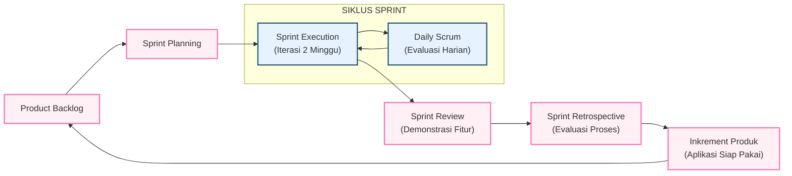
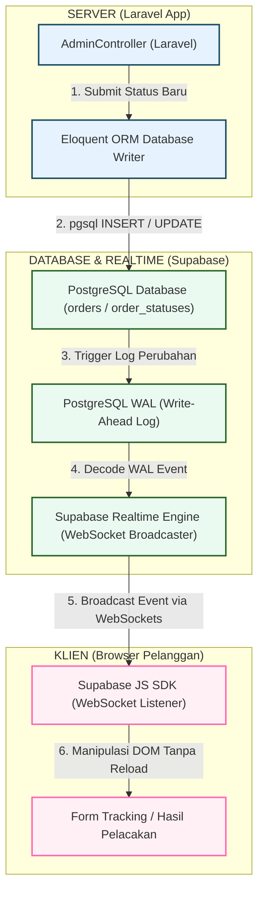
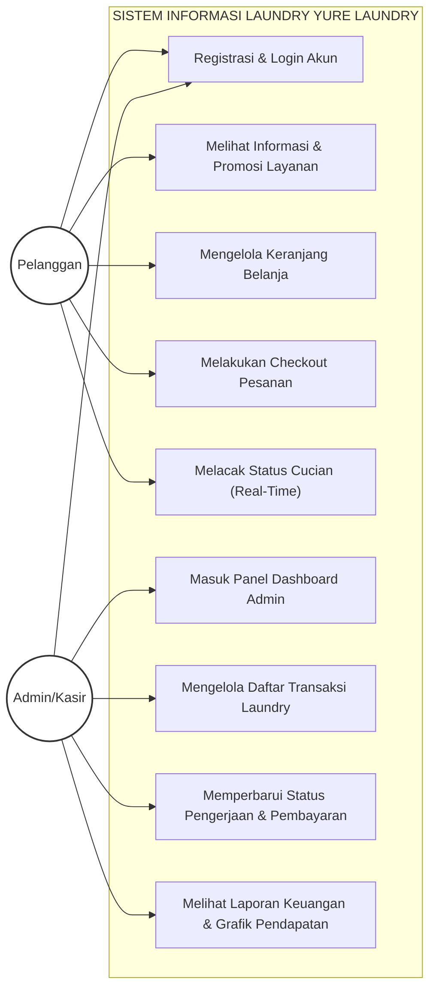
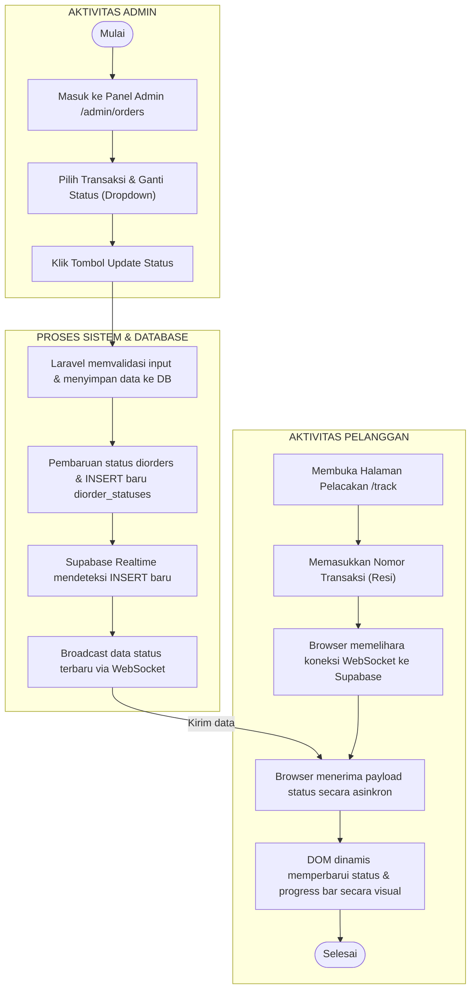
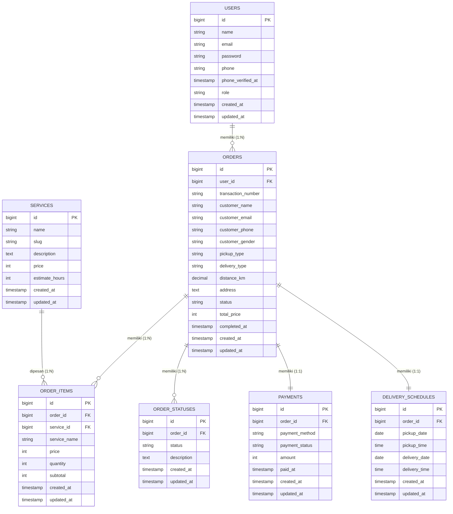

# BAB 2: METODE PENELITIAN DAN PERANCANGAN SISTEM

## 2.1 Metode Penelitian
Penelitian rancang bangun sistem informasi pelayanan dan promosi laundry ini menggunakan metode rekayasa perangkat lunak berbasis **System Development Life Cycle (SDLC)** dengan model **Agile** menggunakan framework **Scrum**. Pilihan ini didasarkan pada kebutuhan pengembangan sistem yang adaptif, kolaboratif, serta membutuhkan iterasi yang cepat agar fitur *real-time tracking* dan antarmuka pelayanan dapat diselesaikan secara inkremental dan diuji secara berkelanjutan. Menurut Hilmyansyah dkk. (2022), Scrum adalah salah satu kerangka kerja Agile yang paling dominan digunakan dalam rekayasa perangkat lunak karena sifatnya yang kolaboratif dan adaptif terhadap perubahan fungsionalitas produk. Penerapan Scrum pada perancangan sistem informasi berbasis web terbukti mampu mengoptimalkan pembagian kerja dalam siklus Sprint secara terukur (Mardika & Fauzi, 2022).

Scrum membagi proses pengembangan ke dalam siklus kerja berulang yang disebut *Sprint* (biasanya berdurasi 1 hingga 2 minggu). Alur siklus pengembangan menggunakan model Scrum yang diterapkan dalam penelitian ini digambarkan secara visual pada Gambar 2.1.

*Gambar 2.1: Siklus Pengembangan Agile Scrum pada Sistem YURE Laundry*

Penjelasan rincian tahapan implementasi Scrum pada penelitian ini adalah sebagai berikut:

1.  **Product Backlog**: 
    Menyusun daftar prioritas seluruh kebutuhan fitur sistem informasi laundry. Daftar ini mencakup registrasi pengguna, kelola keranjang layanan, pembayaran QRIS/Tunai, pelacakan real-time cucian, halaman manajemen admin, serta dashboard keuangan.
2.  **Sprint Planning**:
    Pertemuan untuk menentukan backlog mana yang akan dikerjakan pada siklus *Sprint* berjalan. Target *Sprint* didefinisikan (misalnya: *Sprint* 1 fokus pada pembuatan database dan autentikasi, *Sprint* 2 fokus pada transaksi dan pelacakan real-time).
3.  **Sprint Execution**:
    Proses pengodean fungsionalitas sistem selama durasi *Sprint* (2 minggu). Backend dan frontend dikembangkan menggunakan framework Laravel 11 terintegrasi database PostgreSQL Supabase.
4.  **Daily Scrum**:
    Evaluasi harian singkat untuk membahas apa yang telah diselesaikan, hambatan yang dihadapi (seperti konfigurasi driver pgsql), dan apa yang akan dikerjakan selanjutnya.
5.  **Sprint Review**:
    Melakukan demo aplikasi fungsional yang berhasil diselesaikan pada akhir *Sprint* untuk divalidasi kebenarannya (seperti simulasi perubahan status pengerjaan laundry).
6.  **Sprint Retrospective & Product Increment**:
    Melakukan evaluasi internal terhadap alur kerja tim untuk perbaikan pada *Sprint* berikutnya. Hasil akhir dari setiap *Sprint* adalah *increment* produk berupa modul aplikasi yang siap pakai dan bebas dari error mayor.

---

## 2.2 Perancangan Sistem

### 2.2.1 Arsitektur Sistem
Sistem dibangun menggunakan arsitektur *hybrid client-server* yang mengintegrasikan framework Laravel sebagai pengendali logika bisnis utama (*main controller*) dan antarmuka dinamis dengan Supabase sebagai penyedia infrastruktur basis data awan berbasis PostgreSQL serta WebSocket server mandiri. Framework Laravel dipilih karena memiliki fungsionalitas arsitektur MVC (Model-View-Controller) yang tangguh dan mempermudah percepatan pengembangan kode program pelayanan laundry (Utami & Praja, 2023; Putra dkk., 2021).

Gambar 2.2 menunjukkan skema aliran data integrasi Laravel dan Supabase Realtime.

*Gambar 2.2: Arsitektur Integrasi Real-Time Tracking Laravel dan Supabase*

Cara kerja mekanisme pelacakan real-time ini dijabarkan sebagai berikut:
1.  **Pemicu (*Trigger*) Perubahan**: Ketika kasir mengubah status pengerjaan pakaian pada panel admin Laravel (misal: mengubah status order dari "Antre" menjadi "Diproses"), Laravel akan mengirimkan query pembaruan ke database PostgreSQL Supabase.
2.  **Pemantauan WAL (*Write-Ahead Log*)**: Supabase secara aktif mendengarkan berkas WAL PostgreSQL. Setiap operasi `INSERT` baru pada tabel `order_statuses` didekode secara instan oleh Supabase Realtime.
3.  **Penyiaran WebSocket**: Supabase Realtime memancarkan event perubahan data tersebut dalam format JSON melalui koneksi WebSocket yang *persistent* ke kanal (*channel*) berlangganan. Implementasi pelacakan secara *real-time* terbukti dapat mengeliminasi ketidakpastian informasi proses pengerjaan cucian bagi pelanggan (Nugraha & Alfarid, 2025). Untuk mendukung hal tersebut, digunakan protokol WebSocket yang memungkinkan pertukaran data dua arah secara asinkron dengan overhead minimal dan performa latensi yang jauh lebih rendah dibandingkan HTTP polling (Sari & Setiawan, 2021).
4.  **Penerimaan di Sisi Klien**: Halaman web pelacakan pelanggan yang memuat pustaka `@supabase/supabase-js` menerima payload data tersebut secara asinkron, kemudian memanipulasi elemen DOM (progress bar / stepper) untuk menampilkan status terbaru secara instan tanpa perlu me-refresh halaman web.

---

### 2.2.2 Use Case Diagram
Fungsionalitas sistem dibagi ke dalam dua kategori aktor dengan hak akses yang berbeda: **Pelanggan** (*Customer*) dan **Admin/Kasir**. 

Gambar 2.3 menggambarkan Use Case diagram untuk sistem informasi BubbleWash.

*Gambar 2.3: Use Case Diagram Aplikasi YURE Laundry*

Aktor dalam sistem ini memiliki deskripsi peran sebagai berikut:
*   **Pelanggan**: Mengakses halaman utama untuk melihat harga pelayanan dan promosi. Pelanggan terdaftar dapat memesan layanan dengan memasukkan barang ke keranjang belanja, menentukan lokasi penjemputan/pengantaran pakaian pada peta interaktif, melakukan checkout transaksi, dan menggunakan kode resi untuk melacak cucian mereka secara real-time.
*   **Admin/Kasir**: Memiliki hak administratif penuh untuk mengontrol data operasional laundry. Admin bertugas menerima pesanan masuk, memantau riwayat pembayaran, memperbarui tahapan pengerjaan cucian pelanggan, dan menganalisis laporan keuangan bulanan secara visual melalui grafik.

---

### 2.2.3 Activity Diagram Pelacakan Real-Time
Activity diagram memetakan alur aktivitas yang terjadi antara Admin dan Pelanggan selama proses pembaruan status cucian hingga tampil di layar pelacakan pelanggan secara real-time.

Gambar 2.4 menyajikan visualisasi alur aktivitas pelacakan status.

*Gambar 2.4: Activity Diagram Proses Sinkronisasi Real-Time Tracking*

---

### 2.2.4 Perancangan Basis Data (Entity Relationship Diagram - ERD)
Perancangan basis data didasarkan pada hubungan relasional antar entitas dalam mendukung transaksi laundry terdigitalisasi secara terpusat. Untuk menjamin integritas data serta meminimalisir redundansi data dalam penyimpanan database PostgreSQL Supabase, perancangan ERD dilakukan dengan mengikuti kaidah normalisasi database (Setiyadi, 2018).

Gambar 2.5 menyajikan Entity Relationship Diagram (ERD) fisik yang menggambarkan struktur tabel, atribut, tipe data, serta kardinalitas relasi antar entitas yang diimplementasikan pada database PostgreSQL Supabase secara utuh.

*Gambar 2.5: Entity Relationship Diagram (ERD) Sistem Informasi Laundry YURE Laundry*

Adapun penjelasan relasi logis antar entitas pada Gambar 2.5 adalah sebagai berikut:
1.  **Relasi `USERS` ke `ORDERS` (1 to Many)**: Seorang pelanggan (`users`) dapat memiliki banyak transaksi pesanan (`orders`) laundry, namun satu pesanan hanya dimiliki oleh satu pelanggan terdaftar.
2.  **Relasi `ORDERS` ke `ORDER_ITEMS` (1 to Many)**: Satu transaksi pesanan (`orders`) dapat terdiri atas beberapa detail item layanan yang dicuci (`order_items`).
3.  **Relasi `SERVICES` ke `ORDER_ITEMS` (1 to Many)**: Satu jenis layanan katalog (`services`) dapat dipesan dalam banyak detail transaksi pesanan (`order_items`).
4.  **Relasi `ORDERS` ke `ORDER_STATUSES` (1 to Many)**: Satu transaksi pesanan (`orders`) memiliki banyak catatan riwayat perubahan tahapan pengerjaan (`order_statuses`), yang berfungsi untuk menyajikan urutan proses pelacakan cucian secara kronologis.
5.  **Relasi `ORDERS` ke `PAYMENTS` (1 to 1)**: Satu transaksi pesanan (`orders`) tepat memiliki satu data catatan informasi penagihan pembayaran (`payments`).
6.  **Relasi `ORDERS` ke `DELIVERY_SCHEDULES` (1 to 1)**: Satu transaksi pesanan (`orders`) tepat memiliki satu jadwal logistik penjemputan dan pengantaran pakaian (`delivery_schedules`).

---

### 2.2.5 Perancangan Antarmuka (UI/UX)
Perancangan visual aplikasi YURE Laundry mengadopsi tema estetika modern "Pink Cute & Clean" untuk menarik pasar target utama (kelompok mahasiswa dan rumah tangga urban). 

Beberapa rancangan tata letak antarmuka utama meliputi:
1.  **Halaman Publik Layanan (`/services`)**: Menampilkan deretan kartu grid transparan (*glassmorphism*) yang menyajikan nama layanan, harga transparan, deskripsi, dan tombol tambah ke keranjang.
2.  **Halaman Pelacakan Pesanan (`/track`)**: Memuat kolom pencarian nomor transaksi. Hasil pelacakan menampilkan detail ringkasan pesanan dan deretan *stepper timeline* dinamis berwarna pink yang terhubung langsung dengan Supabase Realtime WebSocket client.
3.  **Halaman Dashboard Admin (`/admin/orders`)**: Merupakan panel tata kelola transaksi yang bersih dan rapi. Dilengkapi dengan tabel daftar transaksi aktif, filter tab status, serta tombol dropdown aksi penggantian status pesanan yang memicu sinkronisasi real-time instan ke pelanggan.

---

## TAMBAHAN REFERENSI DAFTAR PUSTAKA (INDONESIA / GOOGLE SCHOLAR)

Berikut adalah referensi jurnal nasional Indonesia ber-ISSN/terindeks yang dapat disalin ke daftar pustaka laporan akhir Anda untuk mendukung kutipan di Bab 2:

*   Setiyadi, D. (2018). Normalisasi Dalam Perancangan Basis Data Relasional Purchase Order (PO). *Informatics for Educators and Professionals: Journal of Informatics*, 3(1), 51-60.
*   Hilmyansyah, M., Malabay, M., Simorangkir, H., & Yulhendri, Y. (2022). Implementasi Metode Scrum Pada Pembangunan Sistem Informasi Monitoring Progress Proyek Berbasis Web (Studi Kasus: PT Quatra Engineering Mandiri). *IKRA-ITH Informatika: Jurnal Komputer dan Informatika*, 6(3), 253-262.
*   Hidayat, R., & Widianto, K. (2021). Penerapan Metode Agile Scrum Pada Pengembangan Aplikasi Sistem Informasi. *Jurnal Teknologi dan Sistem Informasi (JTIS)*, 2(1), 35-43.
*   Mardika, P. D., & Fauzi, A. (2022). Implementasi Metode Scrum Pada Perancangan Sistem Informasi Tata Usaha Sekolah Berbasis Web. *Jurnal Publikasi Teknik Informatika*, 1(1), 1-10.
*   Nugraha, M., & Alfarid, M. N. N. (2025). Implementation of Web-Based Real-Time Laundry Status Tracking System. *Journal of Information Technology and Its Utilization (JITU)*, 8(2), 45-51.
*   Putra, A. D., Sakethi, D., & Ardiansyah, A. (2021). Pengembangan Sistem Pengelolaan Laundry Berbasis Web (Studi Kasus Arin Laundry). *Jurnal Pepadun*, 2(1), 89-98.
*   Sari, M. P., & Setiawan, A. (2021). Penerapan Websocket pada Sistem Live Chat berbasis Web (Studi Kasus Website Kwikku.com). *Jurnal Pengembangan Teknologi Informasi dan Ilmu Komputer*, 5(12).
*   Utami, L. A., & Praja, H. D. (2023). Sistem Informasi Pelayanan Laundry Berbasis Web pada CV. Indorrama Bogor. *Jurnal Teknoinfo*, 17(2), 398–407.
